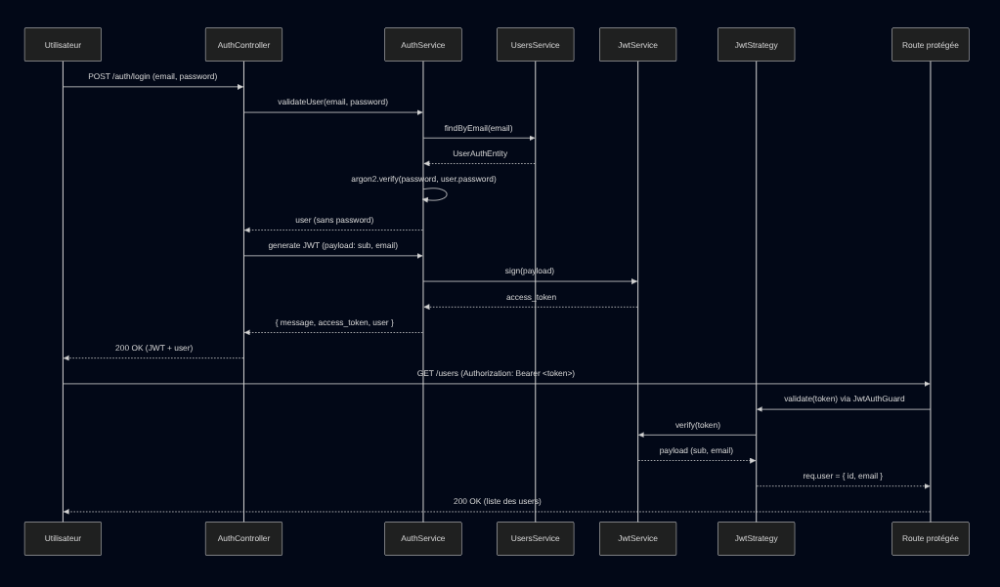

[⬅ Back to README](../../../README.md)

## Module Auth — Documentation Technique

<details>
  <summary style="font-size: 1.1rem; cursor: pointer;"><strong>Sommaire</strong></summary>

<br/>

- [Objectif du module](#objectif-du-module)
- [Structure du module](#structure-du-module)
- [Fonctionnement général](#fonctionnement-général)
- [DTOs](#dtos)
- [Entities](#entities)
- [Interfaces](#interfaces)
- [Guards](#guards)
- [Strategies](#strategies)
- [AuthModule](#authmodule)
- [Test via Swagger](#test-via-swagger)
- [Diagramme de séquence](#diagramme-de-séquence--auth-login--route-protégée)
- [Notes importantes](#notes-importantes)

</details>

## Objectif du module

- Le module Auth gère l’authentification des utilisateurs via :
- la création de compte (Register)
- la connexion (Login)
- la génération de JWT
- la validation des tokens via Passport + JwtStrategy
- la protection des routes via JwtAuthGuard

Il s’appuie sur :

- NestJS
- Passport
- JWT
- Argon2 pour le hashing des mots de passe
- Prisma via UsersService

## Structure du module

```code
src/modules/auth/
│
├── auth.controller.ts
├── auth.module.ts
├── auth.service.ts
│
├── dto/
│   ├── login.dto.ts
│   └── register.dto.ts
│
├── entities/
│   └── user-auth.entity.ts
│
├── guards/
│   └── jwt-auth.guard.ts
│
├── interfaces/
│   └── payload.interface.ts
│
└── strategies/
    └── jwt.strategy.ts
```

## Fonctionnement général

### 1. Register

- Reçoit un email + password
- Délègue la création au UsersService
- Le mot de passe est hashé via Argon2
- Retourne un UserEntity (sans password)

### 2. Login

- Vérifie les credentials via validateUser()
- Génère un JWT contenant :

```ts
{
  sub: user.id,
  email: user.email
}
```

- Retourne

```ts
{
  "message": "Login successful",
  "access_token": "<jwt>",
  "user": { "id": "...", "email": "..." }
}
```

### 3. JWT Strategy

- Extrait le token depuis `Authorization: Bearer <token>`
- Vérifie la signature
- Vérifie l’expiration

- Injecte dans `req.user` :

```ts
{ id: payload.sub, email: payload.email }
```

### 4. JwtAuthGuard

- Protège les routes
- Déclenche automatiquement la stratégie
- Retourne 401 si le token est absent ou invalide

Exemple d’utilisation :

```ts
@UseGuards(JwtAuthGuard)
@ApiBearerAuth()
@Get('me')
getProfile(@Req() req) {
  return req.user;
}
```

## DTOs

### LoginDto

- email (transformé en lowercase)
- password (min 8 caractères)

### RegisterDto

- email (lowercase)
- password (min 8 caractères)

## Entities

### UserAuthEntity

Entité interne utilisée uniquement pour l’authentification.  
Contient le mot de passe (nécessaire pour Argon2).

## Interfaces

### JwtPayload

```ts
{
  sub: string;
  email: string;
}
```

## Guards

### JwtAuthGuard

Permet de protéger une route :

```ts
@UseGuards(JwtAuthGuard)
@ApiBearerAuth()
@Get()
findAll() { ... }
```

## Strategies

### JwtStrategy

- Vérifie le token
- Retourne un user minimal
- Utilise `JWT_SECRET` défini dans `.env`

## Authmodule

Déclare :

- AuthService
- AuthController
- JwtStrategy
- JwtModule
- PassportModule
- UsersModule

Configuration du JWT :

```ts
JwtModule.register({
  secret: process.env.JWT_SECRET,
  signOptions: { expiresIn: '1h' },
});
```

## Test via Swagger

1. Aller sur `auth/login`
2. Récupérer le `access_token`
3. Cliquer sur `Authorize`

Coller :

```code
Bearer <token>
```

4. Tester les routes protégées (ex : `users`)

## Diagramme de séquence — Auth (Login + Route protégée)



## Notes importantes

- Le mot de passe n’est jamais renvoyé
- Le token expire après 1h (configurable)
- Le module est indépendant du module Users
- Le guard peut être appliqué globalement
- Le payload JWT ne doit jamais contenir d’informations sensibles
