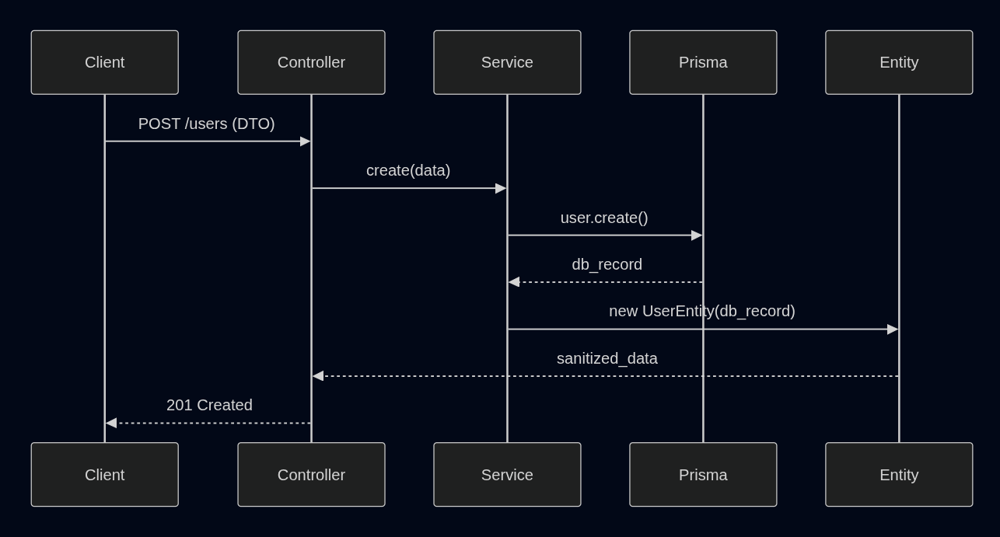

[⬅ Back to README](../README.md)

## 1. Présentation du module Users

Le module Users gère la création, la récupération et la représentation des utilisateurs dans l’API.

Il s’appuie sur :

- Prisma 5.22 pour l’accès à la base de données
- DTOs pour la validation des entrées
- Entities pour la sérialisation et Swagger
- NestJS pour l’architecture modulaire

## 2. Architecture du module

```code
src/modules/users
├── dto
│   ├── create-user.dto.ts
│   └── update-user.dto.ts
├── entities
│   └── user.entity.ts
├── services
│   └── users.service.ts
├── users.controller.ts
└── users.module.ts
```

Rôle de chaque fichier

| Fichier                 | Rôle                                       |
| ----------------------- | ------------------------------------------ |
| users.module.ts         | Déclare le module et ses dépendances       |
| users.controller.ts     | Expose les endpoints HTTP                  |
| users.service.ts        | Contient la logique métier                 |
| dto/create-user.dto.ts  | Valide et transforme les données d’entrée  |
| entities/user.entity.ts | Structure les données de sortie et Swagger |

## 3. Modèle Prisma associé

```json
model User {
  id        String   @id @default(uuid())
  email     String   @unique
  name      String?
  createdAt DateTime @default(now())
  updatedAt DateTime @updatedAt
}
```

## 4. DTO : validation des entrées

`CreateUserDto` applique :

- transformation automatique (`toLowerCase`, `trim`)
- validation stricte (`IsEmail`, `MaxLength`, etc.)
- champs optionnels gérés proprement

Exemple :

```json
{
  "email": "john.doe@example.com",
  "name": "John"
}
```

## 5. Entity : structure de sortie

`UserEntity` :

- garantit une sortie propre et documentée
- masque les champs sensibles (si ajout futur)
- synchronise Swagger avec la réalité de la DB

Swagger affiche automatiquement :

```json
{
  "id": "uuid",
  "email": "john.doe@example.com",
  "name": "John",
  "createdAt": "2025-01-10T09:15:32.123Z",
  "updatedAt": "2025-01-10T09:15:32.123Z"
}
```

## 6. Endpoints exposés

### ➤ POST `/users`

Créer un utilisateur.

Body attendu

```json
{
  "email": "john.doe@example.com",
  "name": "John"
}
```

### Réponse

`201 Created`

```json
{
  "id": "uuid",
  "email": "john.doe@example.com",
  "name": "John",
  "createdAt": "...",
  "updatedAt": "..."
}
```

### Erreurs possibles

| Code  | Raison             |
| ----- | ------------------ |
| `400` | DTO invalide       |
| `409` | Email déjà utilisé |

### ➤ GET `/users`

Retourne tous les utilisateurs triés par date de création (plus récent en premier).

Réponse
`200` OK

```json
[
  {
    "id": "uuid",
    "email": "john.doe@example.com",
    "name": "John",
    "createdAt": "...",
    "updatedAt": "..."
  }
]
```

### ➤ GET `/users/:id`

Récupère un utilisateur par son UUID.

- **Validation** : `ParseUUIDPipe` sur l'ID.
- **Erreur 404** : Si l'utilisateur n'existe pas.

### ➤ PATCH `/users/:id`

Met à jour partiellement un utilisateur.

- **DTO** : `UpdateUserDto` (Partial de CreateUserDto).
- **Validation** : `ParseUUIDPipe` sur l'ID.

### ➤ DELETE `/users/:id`

Supprime un utilisateur.

- **Réponse** : `200 OK` avec l'entité supprimée.
- **Validation** : `ParseUUIDPipe` sur l'ID.

## 7. Flux interne (Controller → Service → Prisma → Entity)

```code
POST /users
   ↓
UsersController.create()
   ↓
UsersService.create()
   ↓
PrismaService.user.create()
   ↓
new UserEntity()
   ↓
Réponse API
```

```code
PATCH /users/:id
   ↓
ParseUUIDPipe (Vérifie le format 400)
   ↓
UsersController.update()
   ↓
UsersService.findOne() (Vérifie l'existence 404)
   ↓
UsersService.update()
   ↓
PrismaService.user.update()
```



## 8. Points forts du module

- Validation stricte des entrées
- Sérialisation propre et documentée
- Architecture NestJS standard et scalable
- Prisma 5.22 stable et compatible Node 22
- Code lisible, modulaire, maintenable
